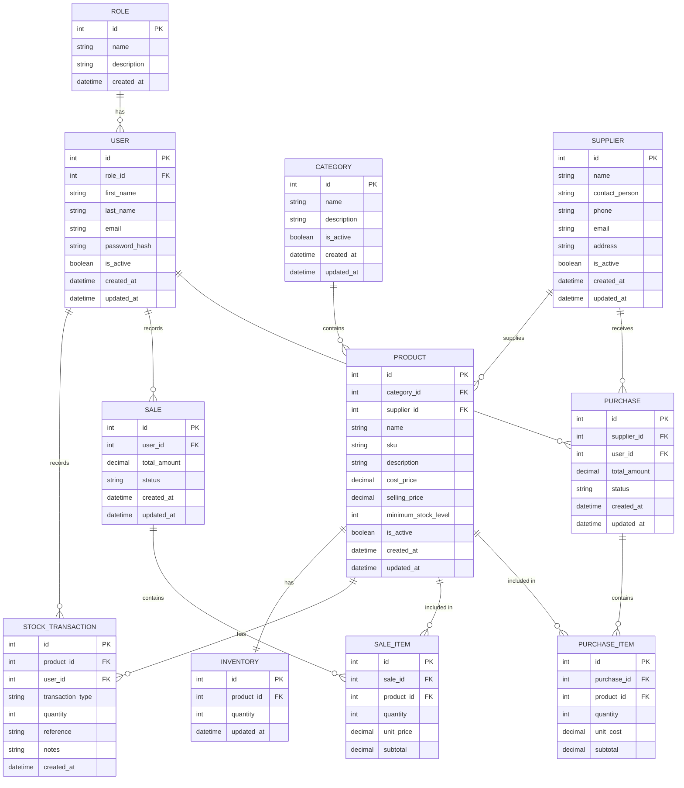

# StockFlow — Database ERD

This diagram shows the main entities in the StockFlow database and the relationships between them.

```mermaid
erDiagram

    ROLE {
        int id PK
        string name
        string description
        datetime created_at
    }

    USER {
        int id PK
        int role_id FK
        string first_name
        string last_name
        string email
        string password_hash
        boolean is_active
        datetime created_at
        datetime updated_at
    }

    CATEGORY {
        int id PK
        string name
        string description
        boolean is_active
        datetime created_at
        datetime updated_at
    }

    SUPPLIER {
        int id PK
        string name
        string contact_person
        string phone
        string email
        string address
        boolean is_active
        datetime created_at
        datetime updated_at
    }

    PRODUCT {
        int id PK
        int category_id FK
        int supplier_id FK
        string name
        string sku
        string description
        decimal cost_price
        decimal selling_price
        int minimum_stock_level
        boolean is_active
        datetime created_at
        datetime updated_at
    }

    INVENTORY {
        int id PK
        int product_id FK
        int quantity
        datetime updated_at
    }

    STOCK_TRANSACTION {
        int id PK
        int product_id FK
        int user_id FK
        string transaction_type
        int quantity
        string reference
        string notes
        datetime created_at
    }

    SALE {
        int id PK
        int user_id FK
        decimal total_amount
        string status
        datetime created_at
        datetime updated_at
    }

    SALE_ITEM {
        int id PK
        int sale_id FK
        int product_id FK
        int quantity
        decimal unit_price
        decimal subtotal
    }

    PURCHASE {
        int id PK
        int supplier_id FK
        int user_id FK
        decimal total_amount
        string status
        datetime created_at
        datetime updated_at
    }

    PURCHASE_ITEM {
        int id PK
        int purchase_id FK
        int product_id FK
        int quantity
        decimal unit_cost
        decimal subtotal
    }

    ROLE ||--o{ USER : "has"

    CATEGORY ||--o{ PRODUCT : "contains"

    SUPPLIER ||--o{ PRODUCT : "supplies"

    PRODUCT ||--|| INVENTORY : "has"

    PRODUCT ||--o{ STOCK_TRANSACTION : "has"

    USER ||--o{ STOCK_TRANSACTION : "records"

    USER ||--o{ SALE : "records"

    SALE ||--o{ SALE_ITEM : "contains"

    PRODUCT ||--o{ SALE_ITEM : "included in"

    SUPPLIER ||--o{ PURCHASE : "receives"

    USER ||--o{ PURCHASE : "records"

    PURCHASE ||--o{ PURCHASE_ITEM : "contains"

    PRODUCT ||--o{ PURCHASE_ITEM : "included in"
```